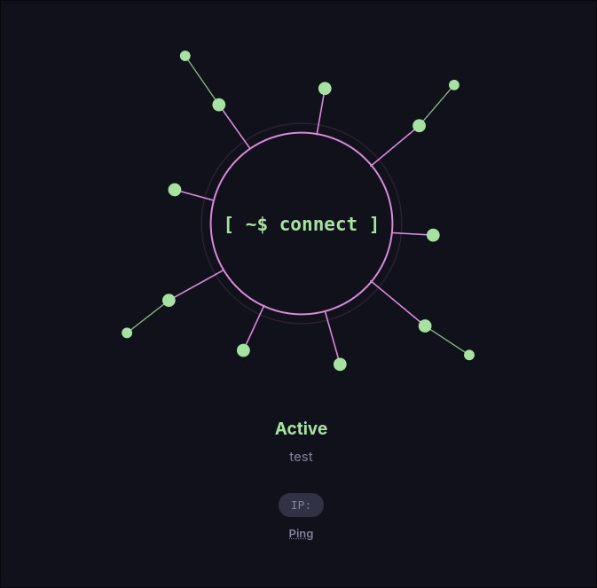
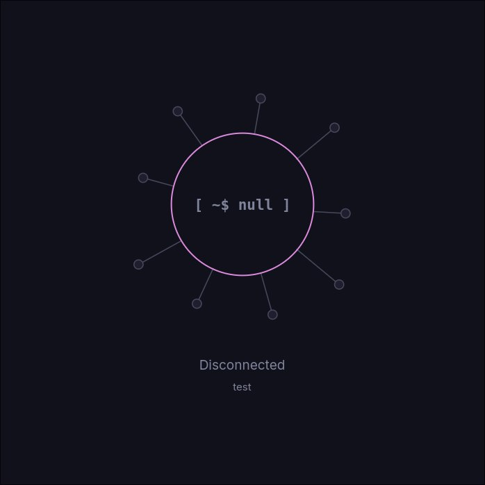
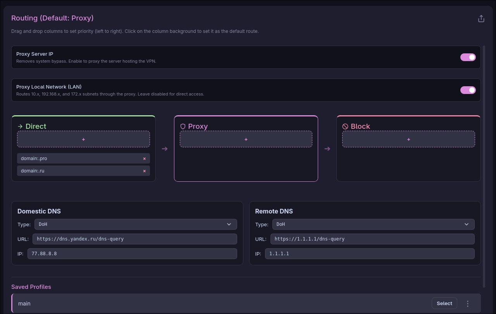
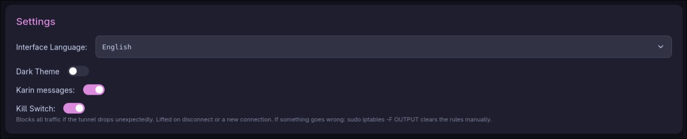

<div align="center">

<h1>KarinCore</h1>
<p><strong>Современный, эстетичный и безопасный прокси-клиент для Linux</strong></p>
<p>
<a href="README.md">🇬🇧 English</a> | <a href="README-ru.md">🇷🇺 Русский</a>
</p>

<p>


</p>
</div>

<br/>

## Философия проекта

Интернет должен быть свободным, а инструменты для его защиты не должны превращаться в ежедневный ритуал.

KarinCore создана, чтобы избавить пользователей Linux от ручной правки JSON-конфигов, борьбы с `iptables` и постоянного присмотра за systemd-юнитами ради банально работающего туннеля. Это мост между по-настоящему мощным ядром обхода блокировок (Xray, OpenVPN, WireGuard) и интерфейсом, который уважает твоё время и не режет глаза.

Никакого Electron. Никаких песочниц, ломающих маршрутизацию. Только ядро на Rust, нативная интеграция с `systemd` и интерфейс, спроектированный именно под эту программу — а не общий шаблон с прикрученным прокси-клиентом.

<br/>

## Что нового в 1.3

Это не патч — это полное визуальное и функциональное переосмысление.

* **Новое ядро подключения.** Обычной кнопки больше нет — вместо неё анимированный граф-объект: скобочный курсор, который сам "допечатывается" при подключении, узлы графа, загорающиеся по очереди, и дышащий пульс, пока туннель жив. Отключение — та же анимация в точности наоборот.
* **Настоящий Kill Switch.** Включается в настройках — и KarinCore блокирует весь исходящий трафик на уровне firewall в момент, когда туннель неожиданно пропадает, а не только когда ты отключаешься сам. Правила переживают падение и автоперезапуск демона — в этом и весь смысл killswitch.
* **Профили убраны с дороги.** Сохранённые конфиги теперь живут в выезжающей боковой панели, а не занимают место на главном экране. Выбрал — подсветился мягким акцентным свечением — вернулся на экран подключения, где внимание ничто не отвлекает от самого ядра.
* **Светлая тема, которой реально хочется пользоваться.** Старая была почти прямой инверсией тёмной. Новая собрана с нуля на тёплых, малоконтрастных нейтральных тонах — читается комфортно, не ощущается как другое приложение.
* **Более спокойная вкладка маршрутизации.** Та же логика drag & drop и те же настройки DNS, только тоньше рамки и сдержаннее в целом.

<br/>

### v1.3.8 — Импорт маршрутизации из подписки

* **Исправлено:** маршрутизация и DNS, которые подписка передаёт в HTTP-заголовке `routing` (формат Happ — так их получают мобильные клиенты), игнорировались, потому что читалось только тело ответа. Теперь они сохраняются отдельным профилем маршрутизации с названием подписки — правила direct / proxy / block и режим маршрута по умолчанию (`GlobalProxy`). Чтобы им пользоваться, выбери его кнопкой «Выбрать»: текущая маршрутизация и DNS никогда не подменяются автоматически, а DNS из подписки не импортируется (эти адреса рассчитаны на мобильные клиенты). Повторное добавление той же подписки обновляет её профиль. Порядок правил и domain strategy не имеют аналога в интерфейсе KarinCore и намеренно не импортируются.
* **Исправлено:** при включённом Kill Switch трафик зоны Direct блокировался файрволом вместе со всем остальным, из-за чего правила Direct молча переставали работать. Теперь трафик, который Xray отправляет в direct-outbound (метка `255`), проходит через Kill Switch; всё остальное по-прежнему блокируется при обрыве туннеля.
* **Исправлено:** зона с доменными и IP-правилами одновременно (например, `domain:.pro` вместе с `geoip:ru` в Direct) собиралась в одно правило Xray, где условия объединяются через И, — домен срабатывал, только если совпадал и его IP, и такие правила Direct молча не работали. Теперь домены и IP превращаются в отдельные правила.

### v1.3.7 — Мёртвый код и перетаскивание окна

* **Исправлено:** перетаскивание окна за собственный титлбар на некоторых системах молча не работало — для фреймлесс-окна в Tauri v2 `data-tauri-drag-region` реально работает только при наличии разрешения `core:window:allow-start-dragging`, которого не было в файле capabilities приложения.
* **Удалено:** мёртвый бинарный таргет Cargo `karin-proxy-daemon` — наследие прежней архитектуры, HTTP-сервер на порту 9090, применявший конфиг по HTTP и перезапускавший сервис. Его никто не вызывает: реальный systemd-юнит `karin-proxy-daemon.service` запускает Xray напрямую. Он сам и его неиспользуемая зависимость `axum` только зря увеличивали время сборки.

### v1.3.6 — Чистка маршрутизации и импорт подписок

* **Исправлено:** `route.sh` оставлял после отключения мёртвые записи `ip rule` для bypass'а локальных подсетей (loopback, приватные диапазоны) и обнулял sysctl `rp_filter` при подключении, никогда не восстанавливая его. Теперь всё это убирается / восстанавливается при отключении — по той же схеме бэкапа/восстановления, что уже используется для `resolv.conf`.
* **Исправлено:** импорт полной JSON-подписки (со своими блоками `routing`/`dns`, а не просто списком прокси-ссылок) молча отбрасывал эту маршрутизацию и настройки DNS. Теперь они переводятся в собственные зоны маршрутизации и настройки DNS KarinCore и дополнительно объединяются с вашей текущей конфигурацией. Блок `policy` из подписки (размеры буферов, таймауты) не имеет аналога в интерфейсе KarinCore и намеренно не импортируется.

### v1.3.5 — Исправления протоколов и пинга

* **Исправлено:** импорт ссылки VMess, Trojan или Shadowsocks молча собирал неправильный VLESS-outbound вместо правильного — любой протокол, кроме VLESS/OpenVPN/WireGuard, обрабатывался как VLESS без единой ошибки. Теперь все четыре протокола (VLESS, VMess, Trojan, Shadowsocks) парсятся и проксируются корректно.
* **Исправлено:** кнопка Ping и отображение IP измеряли задержку через общий локальный прокси-порт приложения, который подчиняется тем же правилам маршрутизации, что и весь остальной трафик — если цель теста совпадала с direct-правилом, результат молча отражал прямое соединение, а не туннель. Теперь пинг и проверка IP всегда идут через выделенный путь, принудительно направленный в прокси.

### v1.3.4 — Исправление схемы конфига TUN

* **Исправлено:** в конфиге TUN-инбаунда присутствовало поле `autoRoute: true`, которого не существует в реальной схеме Xray-core (настоящее поле называется `autoSystemRoutingTable` и это массив, а не булево значение) — Xray молча игнорировал его, и оно никогда ни на что не влияло. Убрано; маршрутизацией всегда полноценно занимается собственный `route.sh` KarinCore, а не Xray.

### v1.3.3 — Исправление DNS / systemd-resolved

* **Исправлено:** на системах с `systemd-resolved` (CachyOS, Fedora и большинство современных дистрибутивов) DNS-резолвинг внутри туннеля мог молча не работать — NSS-модуль `systemd-resolved` полностью игнорирует `/etc/resolv.conf`, поэтому прежний способ перезаписи этого файла не давал эффекта. Теперь `route.sh` управляет DNS через `resolvectl`, если он доступен, и только иначе откатывается на старый метод через `resolv.conf`.
* **Исправлено:** резолвинг российских и зарубежных доменов теперь происходит внутри самого Xray и следует тем же правилам direct/proxy, что и остальной трафик — каждый резолвер (DoH или обычный DNS) уходит через свой outbound, так что внутренний DNS больше не заворачивается в туннель без необходимости, а внешний не светится в открытом виде.

### v1.3.2 — Усиление sudoers

* **Исправлено:** ряд правил sudoers позволял приложению копировать произвольный файл в `/usr/local/bin/xray` и делать его исполняемым — теперь Xray используется исключительно из бинарника, установленного пакетным менеджером, а приложение только проверяет его версию, ничего не скачивая и не подменяя.
* **Исправлено:** все привилегированные правила, которые устанавливает приложение, теперь ограничены отдельной группой `karincore`, а не распространяются на всех пользователей системы (новый post-install хук создаёт группу и добавляет в неё тебя).
* **Исправлено:** импортированный профиль OpenVPN или WireGuard мог содержать директивы (`up`, `PostUp` и т.п.), выполняющие внешние команды — теперь они вырезаются перед запуском туннеля, поскольку эти конфиги работают с правами root.

### v1.3.1 — Handheld Mode

* **Исправлено:** на системах, где пользователь состоит в группе `wheel` (по умолчанию на Arch/SteamOS), каждый sudo-вызов из приложения молча требовал пароль — наши правила `sudoers` перекрывались системным правилом `wheel` из-за алфавитного порядка чтения файлов. Это была настоящая первопричина повторяющихся ошибок "нет прав" на Steam Deck.
* **Исправлено:** ядро подключения и элементы вокруг него теперь пропорционально масштабируются на маленьких или нестандартных разрешениях экрана (как у Steam Deck), вместо того чтобы наезжать друг на друга.
* См. раздел [KarinCore на Steam Deck](#karincore-на-steam-deck) ниже — полное руководство по установке для владельцев портативок.

<br/>

## Ключевые возможности

**Многоуровневая маршрутизация.** Нативная интеграция OpenVPN и WireGuard рядом с Xray. Заворачивай VLESS/VMess-трафик внутрь зашифрованного OVPN- или WireGuard-туннеля через policy-based роутинг — либо гоняй Xray напрямую, выбор за тобой.

**Визуальный приоритет маршрутизации.** Перетаскивай колонки — Proxy, Direct, Block — чтобы задать точный порядок, в котором Xray применяет правила. Никакой ручной правки JSON-массивов правил.

**Kill Switch.** Настоящее применение на уровне firewall, а не чекбокс, который просто запоминает твой выбор. Подробнее — в разделе «Что нового в 1.3» выше.

**Контроль bypass и DNS.** Проксирование IP самого VPN-сервера включается одним тумблером. Независимые Domestic и Remote DNS-резолверы с поддержкой DoH/DoU.

**Универсальный парсер и профили.** Закидывай `.ovpn` и `.conf` файлы или вставляй `vless://`/`wg://` ссылки прямо из буфера обмена. Сохраняй целые связки — правила, порядок колонок, DNS — в именованные профили.

**Нативная системная интеграция.** Ядро работает как фоновый демон (`karin-proxy-daemon.service`), с грамотной обработкой MTU и автоматической зачисткой туннелей перед каждым новым подключением — для защиты от утечек.

**Модель без единого запроса пароля.** Точечно настроенный набор правил `/etc/sudoers.d` позволяет интерфейсу управлять сетевыми интерфейсами, маршрутизацией и демоном без единого запроса root-пароля в обычном использовании.

**Карин.** Встроенная терминальная помощница комментирует, что происходит с ядром — статус соединения, проверки DNS, изредка сухая шутка про твоего провайдера. Двадцать реплик и продолжает расти. Отключается в настройках, если хочется тишины.

**Нулевая телеметрия.** Всё работает локально. Ни трекеров, ни аналитики, ни отправки данных куда-либо. Твои ключи, IP-адреса и профили маршрутизации никогда не покидают устройство. Лицензия MIT, исходники полностью открыты.

<br/>

## Скриншоты

<div align="center">


<br/>


</div>

<br/>

## KarinCore на Steam Deck

**KarinCore прекрасно работает на Steam Deck.** SteamOS под капотом — это Arch Linux, поэтому тот же самый AUR-пакет, что и на обычном Linux-десктопе, ставится на Deck без каких-либо особых танцев: полноценный GUI, drag-and-drop маршрутизация, killswitch — всё как есть. Если искал нормальный VPN-клиент для Steam Deck вместо ручной правки конфигов WireGuard через SSH — это оно.

### Перед началом: задай пароль

У аккаунта `deck` по умолчанию обычно **нет пароля** — для игрового режима это не мешает, но `sudo` (который нужен установщику) требует, чтобы пароль вообще существовал. Задай его один раз, в Desktop Mode:

```bash
passwd
```

Следуй подсказкам, дальше — по шагам ниже.

### Переключиться в Desktop Mode

1. Нажми кнопку **STEAM**.
2. Выбери **Power** (Питание).
3. Выбери **Switch to Desktop**.

На рабочем столе открой терминал (Konsole уже установлен).

### Установка на Deck

```bash
sudo steamos-readonly disable
sudo pacman-key --init
sudo pacman-key --populate archlinux
sudo pacman -S --needed base-devel git
yay -S karincore-git
```

`steamos-readonly disable` снимает защиту от записи с системного раздела — SteamOS по умолчанию доступна только для чтения. Это действует до следующего системного обновления SteamOS, после которого перед переустановкой/обновлением KarinCore команду нужно будет повторить.

### Запуск

KarinCore появится в меню приложений, как обычная десктопная программа. Вставь `vless://`-ссылку (или импортируй `.ovpn`/`.conf`), выбери её в боковой панели и нажми на ядро, чтобы подключиться.

Когда закончишь — вернись в игровой режим прямо с рабочего стола: **Return to Gaming Mode**.

### Возможные проблемы

На некоторых образах SteamOS всплывали ещё две проблемы, которые сам пакет починить не может — это разовые системные фиксы, не связанные с KarinCore напрямую.

**`error: ... signature from "GitLab CI Package Builder ... is unknown trust`** (обычно на этапе установки `base-devel`)

Часть пакетов SteamOS пересобирается и подписывается собственным ключом Valve, который не всегда доверенный на свежей системе. Фикс:

```bash
grep "^SigLevel" /etc/pacman.conf   # запомни текущее значение, чтобы вернуть потом
sudo sed -i 's/^SigLevel.*/SigLevel = TrustAll/' /etc/pacman.conf
sudo pacman -Syy
sudo pacman -S holo-keyring archlinux-keyring
sudo pacman-key --populate archlinux holo
sudo sed -i 's/^SigLevel.*/SigLevel = Required DatabaseOptional/' /etc/pacman.conf
sudo pacman -Scc   # почистить кэш пакетов, не прошедших проверку подписи, дальше Y
```

После этого повтори шаг с `base-devel`/`yay -S karincore-git`.

**`feature 'edition2024' is required` / сборка падает где-то в середине компиляции Rust**

Значит системный пакет `rust` на этом образе SteamOS слишком старый. Поставь актуальный набор через `rustup`:

```bash
sudo pacman -S rustup
rustup default stable
rustc --version   # должна быть свежая версия
```

После этого повтори `yay -S karincore-git`.

**Сборка останавливается с сообщением про отсутствующие заголовки `openssl`, `glibc` или `linux-api-headers`**

Та же природа, что и выше (на некоторых образах SteamOS заголовочные файлы физически вырезаны, хотя в базе pacman пакет числится установленным) — сборка сама выведет точную команду для запуска, что-то вроде:

```bash
sudo pacman -S --overwrite '/usr/include/*' openssl glibc linux-api-headers
```

Выполни ровно то, что укажет сообщение, и повтори `yay -S karincore-git`. (Сборка намеренно останавливается и просит выполнить это самостоятельно, а не делает это сама — `PKGBUILD`, вызывающий `sudo` от своего имени, это тревожный звоночек, к которому стоит относиться с подозрением, поэтому здесь так специально не сделано.)

Если столкнулся с чем-то ещё — заведи issue на GitHub, похоже, образы SteamOS отличаются друг от друга сильнее, чем ожидалось, и знать об этом полезно.

<br/>

## Установка

### Arch Linux (AUR)

Рекомендуемый способ для Arch-based систем (Manjaro, EndeavourOS и другие). Соберёт ядро, подтянет зависимости и настроит системные службы автоматически.

```bash
yay -S karincore-git
```

### Ubuntu / Debian / Linux Mint

Свежий `.deb` всегда доступен в разделе [Releases](../../releases). Он сам регистрирует правила `sudoers` и `systemd` при установке. Убедись, что в системе уже стоят `openvpn` и `wireguard-tools`. Xray в `.deb` не входит: установи его отдельно так, чтобы бинарник лежал в `/usr/local/bin/xray` (например, через [XTLS/Xray-install](https://github.com/XTLS/Xray-install)).

```bash
sudo dpkg -i KarinCore_1.3.8_amd64.deb
sudo apt install -f # только если не хватает зависимостей
```

### Первый запуск

Демон **не должен** быть в автозагрузке — иначе он начнёт маршрутизировать трафик ещё до того, как интерфейс сформирует рабочий конфиг.

Не запускай `systemctl enable` для него. Просто открой KarinCore из меню приложений — GUI сам запустит, отслеживает и остановит демона по мере надобности, используя заранее настроенные правила sudo.

<br/>

## Архитектура

Привилегии разделены между одним непривилегированным приложением и небольшим набором служб с правами root:

**Frontend (`karincore`)** — Tauri-интерфейс, целиком работающий в пространстве пользователя. Сам никогда не запускается от root. Привилегированные действия выполняются через фиксированный набор заранее одобренных `sudo`-команд, доступных только участникам группы `karincore`.

**Root-часть** — systemd-служба `karin-proxy-daemon` запускает Xray (или OpenVPN/WireGuard) с сгенерированным конфигом, а `route.sh` поднимает TUN, политику маршрутизации и DNS (`resolvectl`) и возвращает всё обратно при отключении.

Такое разделение означает, что весь графический стек — веб-вью, рендеринг, всё — работает без привилегий. Root получает только та узкая часть, которой он реально нужен.

<br/>

## История версий

<details>
<summary>1.2.x и раньше</summary>

**1.2.8** — Исправлено: приложение при каждом запуске заново скачивало Xray, если он уже был установлен системным пакетом (Arch/AUR/SteamOS), что заодно вызывало лишний запрос пароля sudo при старте.

**1.2.7** — Исправлен ряд привилегированных команд, вызывавшихся без полного пути к бинарнику — это могло молча приводить к ошибке прав в зависимости от того, как шелл резолвил PATH.

**1.2.6** — systemd-юнит демона и скрипт маршрутизации теперь поставляются внутри самого `.deb`-пакета (раньше отсутствовали при чистой установке). Исправлена проверка обновлений, сообщавшая об устаревшей версии. Исправлена необходимость дважды нажимать «Подключить» при холодном старте. Понятнее сообщения об ошибках при сбое демона.

</details>

Полная история — на странице [Releases](../../releases).

<br/>

## Вектор развития

KarinCore создавалась в первую очередь для Linux, но у свободного интернета нет границ ОС. Нативные порты на **Windows** и **macOS** — следующая крупная веха. Карин не собирается останавливаться на одной системе.

<br/>

## Поддержка, контрибьютинг и обратная связь

Проект создаётся и поддерживается силами одного независимого разработчика. Баг-репорты, пул-реквесты и идеи по UI/UX искренне приветствуются.

Если KarinCore помогает тебе оставаться на связи и ты хочешь поддержать разработку — включая грядущие порты на Windows/macOS — можно закинуть донат:

**USDT (TRC20):** `TQCQhGQD6xgaDxwqAVcTiapS6rdcPyf24X`

Если проект оказался полезен — ⭐️ на репозитории будет очень кстати.

<div align="center"><p><a href="README.md">🇬🇧 English</a> | <a href="README-ru.md">🇷🇺 Русский</a></p></div>
