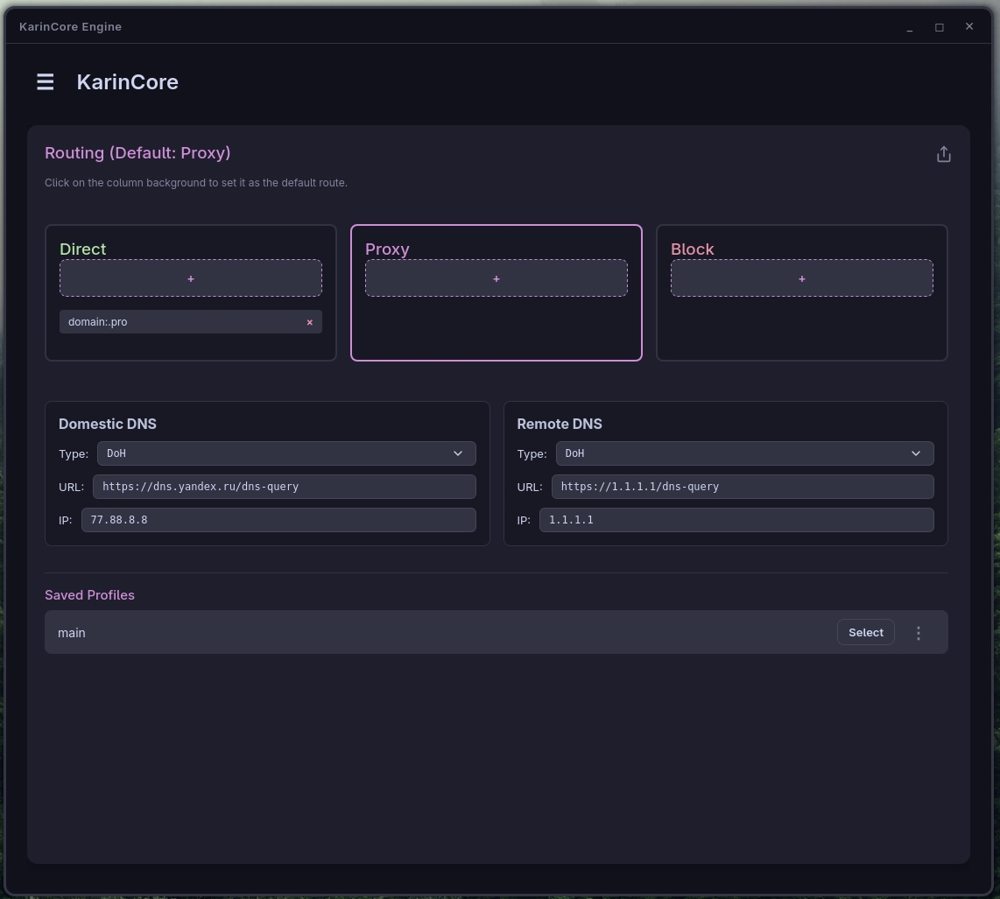

<div align="center">

<h1>KarinCore</h1>
<p><strong>A modern, aesthetic, and secure proxy client for Linux</strong></p>
<p>
<a href="README.md">🇬🇧 English</a> | <a href="README-ru.md">🇷🇺 Русский</a>
</p>


</div>

  

## 🌌 Philosophy

The internet should be free, and the tools to protect it should be accessible and user-friendly.

KarinCore was built to end the struggle of configuring complex CLI utilities, writing endless JSON configs, and manually managing system services on Linux. It serves as a bridge between powerful, low-level anti-censorship protocols (like Xray) and an intuitive, highly aesthetic graphical interface.

No bloated Electron apps, no restrictive sandboxes breaking your system routing. Just a lightweight Rust core, native `systemd` integration, and a blazing-fast UI.

---


## ✨ Key Features

* **Native Integration:** The core runs as a background system daemon (`karin-proxy-daemon.service`), ensuring a stable connection even when the GUI is closed.

* **Seamless UX:** Thanks to dedicated `/etc/sudoers.d` rules, managing network interfaces and routing is just a click away. No annoying root password prompts every time you connect.

* **Smart Routing:** Built-in support for Direct, Proxy, and Block routing modes.

* **Protocol Support:** Fully compatible with VLESS, VMess, Trojan, Shadowsocks, and other modern proxy standards.

* **Minimalist & Lightweight:** Powered by Rust and Tauri. It consumes minimal RAM and has virtually zero CPU overhead.

---

  

## 📸 Screenshots

<div align="center">


</div>

---


## 🚀 Installation

KarinCore is designed for maximum compatibility with modern Linux distributions.


### Arch Linux (AUR)

The recommended installation method for Arch-based systems (Manjaro, EndeavourOS, etc.). This package will automatically compile the core, pull dependencies, and configure system services.

```bash

yay -S karincore-git

```


### Ubuntu / Debian / Linux Mint  

Check the [Releases](../../releases) page for the latest `.deb` package. It automatically configures `sudoers` and `systemd` rules during installation.

```bash

sudo dpkg -i KarinCore_1.0.0_amd64.deb

sudo apt install -f # if any dependencies are missing

```


### First Launch

After installation, you must enable and start the backend daemon so the GUI can communicate with it:

```bash

sudo systemctl enable --now karin-proxy-daemon.service

```

Once the service is running, simply launch KarinCore from your desktop environment's application menu.


## 🛠 Architecture (Under the hood)

The application is cleanly separated into two independent binaries:

**1. Backend (```karin-proxy-daemon```):** A system service written in pure Rust. It runs as root, manages TUN interfaces, routing rules, and network traffic.

**2. Frontend (```karincore```):** A lightweight Tauri GUI running in user-space. It communicates with the daemon via IPC/sockets and safely restarts it using pre-configured sudoers rules.

This privilege separation keeps your system secure by avoiding running the entire graphical stack with superuser privileges.


## 🤝 Contributing & Feedback

Bug reports, pull requests, and UI/UX ideas are highly appreciated!
If you find this tool useful, please consider giving this repository a ⭐️.

<div align="center"><p><a href="README.md">🇬🇧 English</a> | <a href="README-ru.md">🇷🇺 Русский</a></p></div>