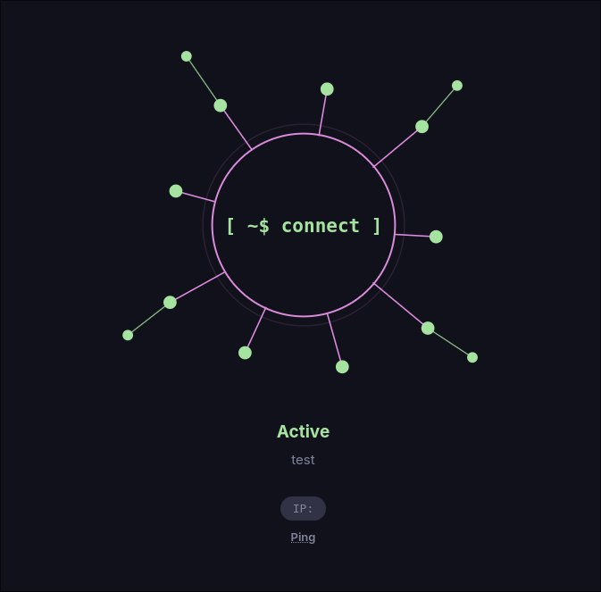
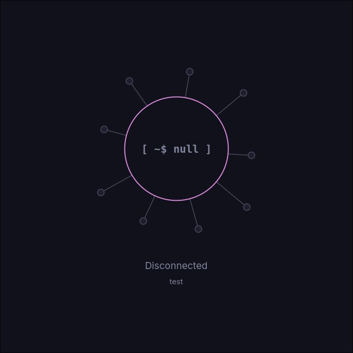
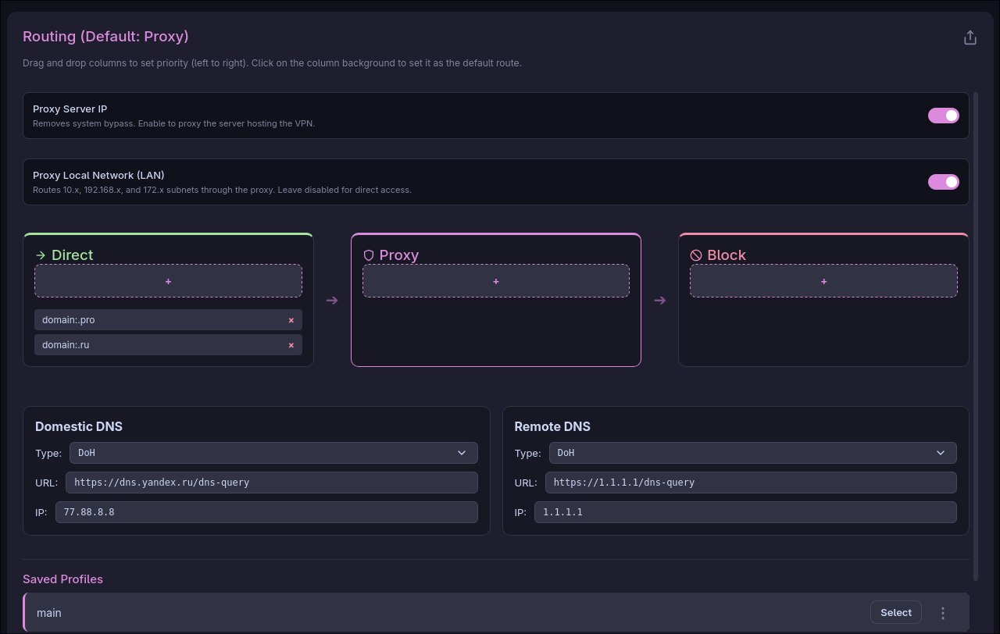
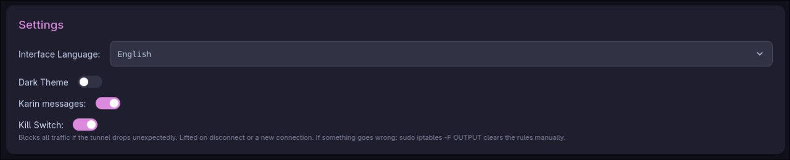

<div align="center">

<h1>KarinCore</h1>
<p><strong>A modern, aesthetic, and secure proxy client for Linux</strong></p>
<p>
<a href="README.md">🇬🇧 English</a> | <a href="README-ru.md">🇷🇺 Русский</a>
</p>

<p>


</p>
</div>

<br/>

## Philosophy

The internet should be free, and the tools that protect it shouldn't feel like a chore to run.

KarinCore exists to end the ritual of hand-editing JSON configs, wrestling with `iptables`, and babysitting systemd units just to get a working tunnel on Linux. It's the bridge between a genuinely powerful anti-censorship core (Xray, OpenVPN, WireGuard) and an interface that respects your time and your eyes.

No Electron. No sandbox fighting your routing table. A Rust core, native `systemd` integration, and a UI built specifically for this app — not a generic template with a proxy client bolted on.

<br/>

## What's new in 1.3

This release is a full visual and functional overhaul, not just a patch.

* **A new connection core.** The connect button is gone — replaced by an animated graph-core visual: a bracket cursor that types itself open on connect, radiating nodes that light up in sequence, and a breathing pulse while the tunnel is live. Disconnecting runs the exact same animation in reverse.
* **A real kill switch.** Enable it in Settings and KarinCore drops all outbound traffic at the firewall level the moment the tunnel disappears unexpectedly — not just when you disconnect on purpose. Rules persist through a daemon crash-and-restart cycle, which is the entire point of a kill switch.
* **Profiles moved out of the way.** Your saved configs now live in a slide-out side panel instead of eating vertical space on the main screen. Pick one, it lights up with a soft accent glow, and you're back on the connect screen — the big glowing core is the only thing competing for your attention.
* **A light theme worth using.** The old light mode was a near-inversion of the dark one. It's been rebuilt from scratch with warm, low-contrast neutrals — readable without feeling like a different app.
* **A calmer routing tab.** Same drag-and-drop priority system, same DNS controls, thinner borders and a bit of restraint.

<br/>

### v1.3.1 — Handheld Mode

* **Fixed:** every sudo call from the GUI silently required a password on systems where the user is in the `wheel` group (the default on Arch/SteamOS) — the app's own sudoers rules were being shadowed by the system's password-requiring wheel rule due to alphabetical file ordering. This was the real root cause behind the recurring "permission denied" errors on Steam Deck.
* **Fixed:** the connection core and its surrounding UI now scale proportionally on smaller or unusual screen resolutions (like Steam Deck's) instead of overlapping.
* See [KarinCore on Steam Deck](#karincore-on-steam-deck) below — full install guide for handheld users.

<br/>

## Key features

**Multi-level routing.** Native OpenVPN and WireGuard integration alongside Xray. Wrap VLESS/VMess traffic inside an encrypted OVPN or WireGuard tunnel via policy-based routing, or run Xray directly — your call.

**Visual routing priority.** Drag columns — Proxy, Direct, Block — to set the exact order Xray evaluates rules. No editing JSON rule arrays by hand.

**Kill switch.** Real firewall-level enforcement, not a checkbox that only remembers your preference. See [What's new in 1.3](#whats-new-in-13) above.

**Bypass and DNS control.** Toggle proxying of the VPN server's own IP with one switch. Independent Domestic and Remote DNS resolvers with DoH/DoU support.

**Universal parser and profiles.** Drop in `.ovpn` and `.conf` files, or paste `vless://`/`wg://` links straight from the clipboard. Save full setups — rules, column order, DNS — as named profiles.

**Native system integration.** The core runs as a background daemon (`karin-proxy-daemon.service`), with MTU handling and automatic tunnel teardown before every new connection to avoid leaks.

**Zero-prompt privilege model.** A tightly scoped `/etc/sudoers.d` rule set means the GUI can manage interfaces, routing, and the daemon without a single root password prompt during normal use.

**Karin.** The built-in terminal assistant narrates what the core is doing — connection status, DNS checks, the occasional dry joke about your ISP. Twenty lines and counting. Can be turned off in Settings if you'd rather have silence.

**Zero telemetry.** Everything runs locally. No trackers, no analytics, no phone-home. Your keys, IPs, and routing profiles never leave your machine. MIT licensed, source fully open.

<br/>

## Screenshots

<div align="center">


<br/>


</div>

<br/>

## KarinCore on Steam Deck

**KarinCore runs great on Steam Deck.** SteamOS is Arch Linux under the hood, so the same AUR package that powers the desktop Linux experience installs cleanly on Deck too — full GUI, drag-and-drop routing, the kill switch, all of it. If you've been looking for a proper VPN client for Steam Deck instead of hand-editing WireGuard configs over SSH, this is built for exactly that.

### Before you start: set a password

Steam Deck's default `deck` account usually has **no password set** — fine for the console experience, but `sudo` (which the installer needs) requires one to exist. Set it once, in Desktop Mode:

```bash
passwd
```

Follow the prompts, then continue below.

### Switch to Desktop Mode

1. Press the **STEAM** button.
2. Select **Power**.
3. Select **Switch to Desktop**.

Open a terminal (Konsole is preinstalled) once you're on the desktop.

### Install

```bash
sudo steamos-readonly disable
sudo pacman-key --init
sudo pacman-key --populate archlinux
sudo pacman -S --needed base-devel git
yay -S karincore-git
```

`steamos-readonly disable` unlocks the system partition so packages can actually install — SteamOS ships read-only by default. This survives until the next SteamOS system update, at which point you'll need to run it again before reinstalling/updating KarinCore.

### Launch

KarinCore appears in your application menu like any other desktop app. Paste in a `vless://` link (or import an `.ovpn`/`.conf`), select it in the side panel, and hit the core to connect.

When you're done, return to Game Mode from the desktop: **Return to Gaming Mode**.

### Troubleshooting

A couple of issues have shown up on some SteamOS images that the package itself can't fix automatically — both are one-time system fixes, not KarinCore-specific.

**`error: ... signature from "GitLab CI Package Builder ... is unknown trust`** (usually shows up while installing `base-devel`)

Some SteamOS package rebuilds are signed with Valve's own CI key, which isn't always trusted by default on a fresh system. Fix:

```bash
grep "^SigLevel" /etc/pacman.conf   # note the current value to restore later
sudo sed -i 's/^SigLevel.*/SigLevel = TrustAll/' /etc/pacman.conf
sudo pacman -Syy
sudo pacman -S holo-keyring archlinux-keyring
sudo pacman-key --populate archlinux holo
sudo sed -i 's/^SigLevel.*/SigLevel = Required DatabaseOptional/' /etc/pacman.conf
sudo pacman -Scc   # clear the cache of packages that failed signature checks, then Y
```

Then retry the `base-devel`/`yay -S karincore-git` step.

**`feature 'edition2024' is required` / build fails partway through Rust compilation**

Means the system `rust` package on your SteamOS image is too old. Install a current toolchain via `rustup` instead:

```bash
sudo pacman -S rustup
rustup default stable
rustc --version   # should be recent
```

Then retry `yay -S karincore-git`.

If you hit something else entirely, open an issue on GitHub — SteamOS images seem to vary more than expected in what's stripped out of them, and it helps to know.

<br/>

## Installation

### Arch Linux (AUR)

The recommended path for Arch-based systems (Manjaro, EndeavourOS, and the rest). Builds the core, pulls dependencies, and wires up system services automatically.

```bash
yay -S karincore-git
```

### Ubuntu / Debian / Linux Mint

Grab the latest `.deb` from [Releases](../../releases). It registers `sudoers` and `systemd` rules on install. Make sure `openvpn` and `wireguard-tools` are present on your system first.

```bash
sudo dpkg -i KarinCore_1.3.1_amd64.deb
sudo apt install -f # only if dependencies are missing
```

### First launch

The daemon should **not** be enabled at boot — that would let it start routing traffic before the GUI has generated a valid config.

Don't run `systemctl enable` on it. Just launch KarinCore from your application menu; the GUI starts, monitors, and stops the daemon on its own using the pre-configured sudo rules.

<br/>

## Architecture

Two independent binaries, separated by privilege:

**Backend (`karin-proxy-daemon`)** — a systemd service running as root. Owns the TUN interface, routing rules, and the Xray/OpenVPN/WireGuard process itself.

**Frontend (`karincore`)** — a Tauri GUI running entirely in user-space. Talks to the daemon over IPC and drives it through a fixed set of pre-approved `sudo` commands. It never runs as root itself.

This split means the entire graphical stack — webview, rendering, everything — runs unprivileged. Only the narrow slice that actually needs root does.

<br/>

## Changelog

<details>
<summary>1.2.x and earlier</summary>

**1.2.8** — Fixed the app redundantly re-downloading Xray on every launch when it was already present as a system package (Arch/AUR/SteamOS), which also caused a spurious sudo prompt at startup.

**1.2.7** — Fixed a set of privileged commands being invoked without a fully-qualified path, which could silently fail with a permission error depending on shell PATH resolution.

**1.2.6** — Shipped the daemon's systemd unit and routing script inside the `.deb` package itself (previously missing on clean installs). Fixed the update checker reporting stale versions. Fixed the need to click Connect twice on a cold start. Clearer daemon-failure error messages.

</details>

Full history on the [Releases](../../releases) page.

<br/>

## Roadmap

KarinCore was built for Linux first, but the free internet doesn't stop at the OS boundary. Native **Windows** and **macOS** ports are the next major milestone — Karin isn't staying put.

<br/>

## Support, contributing, and feedback

Built and maintained by a single independent developer. Bug reports, pull requests, and UI/UX ideas are genuinely welcome.

If KarinCore keeps you connected and you'd like to support development — including the upcoming Windows/macOS ports — you can send a tip:

**USDT (TRC20):** `TQCQhGQD6xgaDxwqAVcTiapS6rdcPyf24X`

If this project is useful to you, a ⭐️ on the repo goes a long way.

<div align="center"><p><a href="README.md">🇬🇧 English</a> | <a href="README-ru.md">🇷🇺 Русский</a></p></div>
